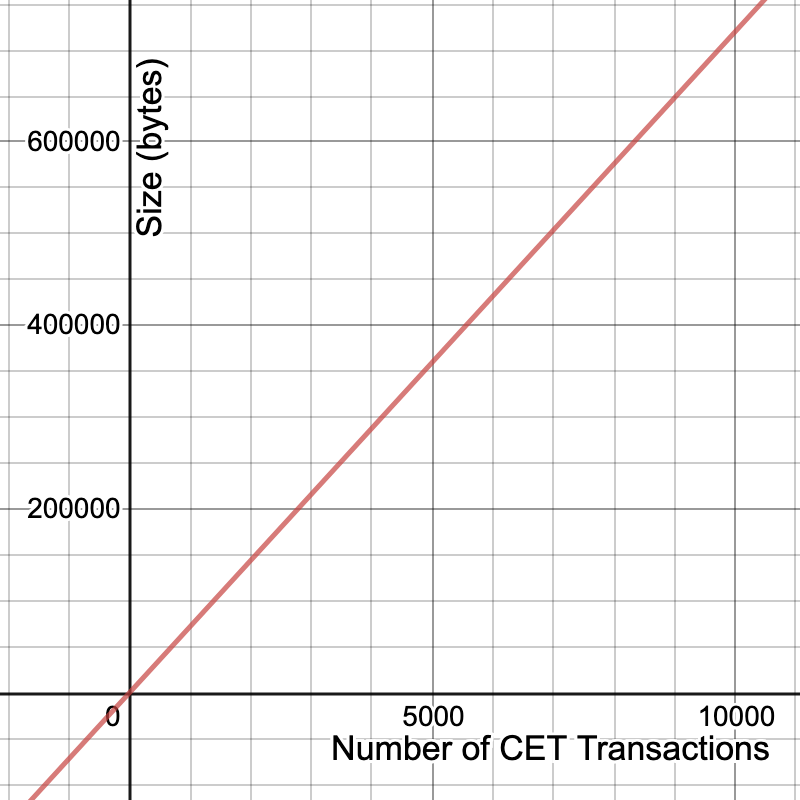
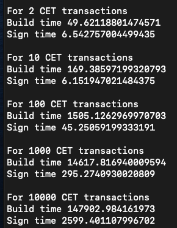

# Message sizes

In a protocol run each participant must send at least 2 messages: A Participant data structure containing all initialisation information and an Accept data structure with all signature information to complete the contract setup. If there is a disagreement in the contract parameters or a error then either of these messages may be modified and re-sent.

Let `n` be the number of CET transactions (possible contract outcomes) and let `m` be the number of UTXOs that the participant is spending in funding the contract.

## Participant

Then the Participant message consists of:
| item | size (bytes) |
| :--: | :-: |
| 1 16-bit integers | 2 |
| (3+`n`) 64-bit integers | (3+`n`)*6 |
| `n` strings | ~`n`*33 |
| 2 addresses | 2*34 |
| 2 public keys | 2*65 |
| `m` inputs | ~`m`*70
| **total** | **~218+41`n`+70`m`** |

Assuming oracle messages are 32 byte string, a fair estimate for Participant message size is 350+39`n` bytes.

10,000 CET transactions creates 0.4MB message.

## Accept

A serialised Accept object consists of:
| item | size (bytes) |
| :--: | :-: |
| 1 16-bit integers | 2 |
| 1 8-bit integer | 1 |
| `m` signatures (p2wpkh)| `m`*107 |
| (`n`+1) signature (p2wsh) | (`n`+1)*72 |
| **total** | **75+72`n`+107`m`** |

So a fair estimate for Accept message size is 300+72`n` bytes.

10,000 CET transactions creates 0.65MB message.

# Computation time

In milliseconds:

# Memory requirements
Each CET transaction is 880 bytes without signatures and 1307 bytes with signatures.
This is a large memory requirement for large `n`, but can be avoided by only temporarily building transactions to create signatures and re-building them if/when it is time to broadcast.
